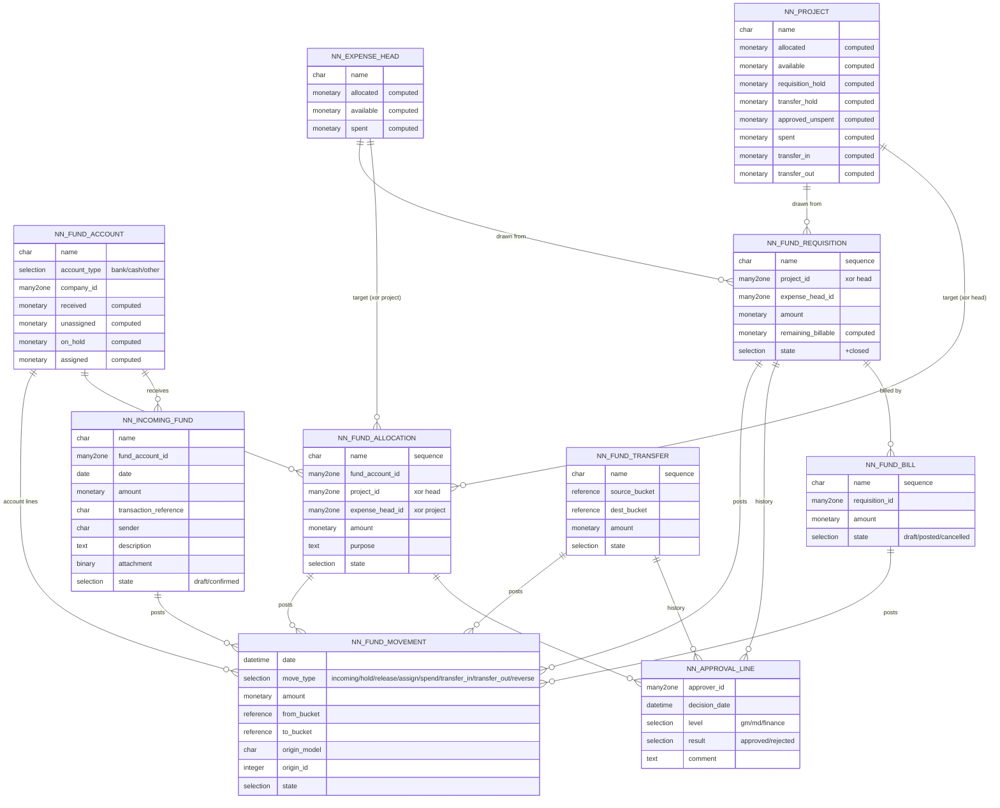

# Entity-Relationship Diagram

> `*_bucket` fields are `reference` (or a pair of nullable many2ones `project_id`/`expense_head_id`
> with a XOR constraint) so a single field can point at either a project or an expense head.
> Decide one style and keep it consistent — see `models-spec.md`.
