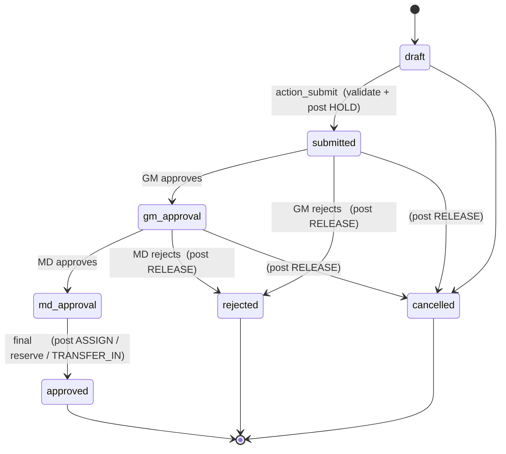
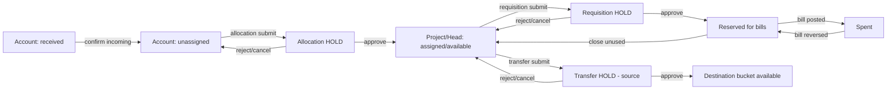
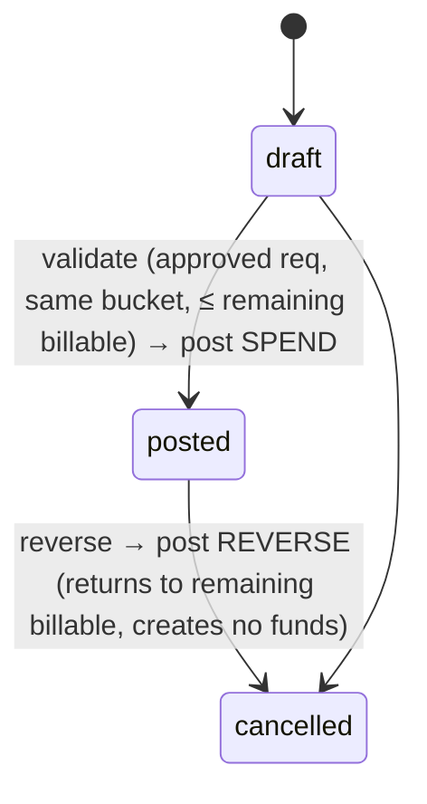

# State Machines & Fund-Flow

## 1. Shared approval workflow (allocation, requisition, transfer)

> Requisition adds one terminal state: `approved --> closed` (fully billed or unused released).
> Guards: MD cannot act before GM (BR-13); only current-level approver acts (BR-14);
> no self-approval (BR-15); each transition posts ledger lines once (BR-03).

## 2. Money flow through a bucket's lifetime

## 3. Bill lifecycle

## 4. Invariant checks fired on each transition
| Transition | Checks (BR refs) |
|------------|------------------|
| allocation submit | amount ≤ account unassigned (BR-10), project XOR head (BR-09) |
| any approve/reject | level order (BR-13), current approver (BR-14), no self-approve (BR-15), idempotent (BR-03) |
| requisition submit | amount ≤ bucket available (BR-20) |
| bill post | approved req (BR-24), same bucket (BR-25/28), ≤ remaining billable (BR-26), total ≤ approved (BR-27) |
| transfer submit | amount ≤ source available (BR-31), source ≠ dest (BR-34) |
| any | resulting balance ≥ 0 (BR-04), no funds created (BR-01) |
